  <picture>
    <source media="(prefers-color-scheme: dark)" srcset="assets/banner.svg" />
    <source media="(prefers-color-scheme: light)" srcset="assets/banner-light.svg" />
    
  </picture>

 

  

 

<h1 align="center">Aryant Shrirang</h1>

<strong>Full Stack Developer (MERN Stack) | AI Automation Engineer</strong>

2.10+ years building and deploying 80+ web applications across SaaS, AI, fintech, and blockchain.

  <a href="mailto:aryantshrirang5@gmail.com">Email</a> ·
  <a href="https://linkedin.com/in/aryant-shrirang-62707122a">LinkedIn</a> ·
  <a href="tel:+918982780884">+91 8982780884</a>

---

## Professional Summary

Results-driven Full Stack Developer with 2.10+ years of professional experience building and deploying 80+ web applications across SaaS, AI automation, fintech, and blockchain domains. Proficient in the complete MERN stack, with strong expertise in RAG-based AI architectures, agentic workflow automation (n8n), 3D web experiences (Three.js), and crypto payment systems. I deliver production-grade, high-performance applications with end-to-end ownership.

---

## About Me

I am a Full Stack Developer (MERN Stack) and AI Automation Engineer at **Digital One Box Pvt. Ltd.** (Oct 2023 – Present). My work spans React.js and Next.js frontends, Node.js and Express APIs, MongoDB data layers, RAG agents with OpenAI and vector databases, n8n-driven agentic workflows, crypto payment gateways with KYC and blockchain APIs, and immersive brand experiences using Three.js and GSAP.

I own systems end to end — architecture, implementation, performance, and delivery — with a focus on measurable outcomes: faster APIs, less manual operations, and products that scale in production.

**Education:** B.Tech in Computer Science — RGPV University (CGPA 8.1 / 10.0)

---

## Core Expertise

- Full-stack MERN development (React.js, Next.js, Node.js, Express.js, MongoDB)
- RAG-based AI architectures and OpenAI / LLM integration
- Agentic AI workflow automation with n8n
- Crypto payment systems and blockchain API integrations
- Immersive 3D and interactive web experiences (Three.js, GSAP, 2D physics)
- Fintech product engineering (credit recovery, billing, analytics)
- SaaS platform design and micro-frontends (Module Federation)
- Brand-aligned UI/UX and responsive motion design

---

## Technology Stack

| Area | Technologies |
| --- | --- |
| **Frontend** | React.js, Next.js, JavaScript (ES6+), Redux, Three.js, GSAP, 2D Physics, Web Animations, HTML5, CSS3, Tailwind |
| **Backend** | Node.js, Express.js, REST API Design, MongoDB |
| **AI & Automation** | RAG Systems, OpenAI APIs, Agentic AI Workflows, n8n, Vector Databases, LLM Integration |
| **Blockchain** | Blockchain APIs, Crypto Payment Systems, MLM Commission Architecture |
| **Architecture** | Micro-Frontends (Module Federation), SaaS Platform Design, Brand-aligned UI/UX, System Design |
| **Tools** | Git, GitHub, Fireblocks, Sumsub KYC |

---

## Professional Achievements

- Shipped **80+ web applications** across SaaS, AI automation, fintech, and blockchain
- Reduced backend API response time by **30%** on Smart Udhar (core fintech product)
- Eliminated **50%** of repetitive manual business tasks via agentic AI automation
- Scaled a crypto trading ecosystem to **3,000+ active users**
- Delivered production crypto payment gateway with Sumsub KYC and blockchain integrations
- Built immersive Three.js / GSAP experiences for multiple client-facing brand projects

---

## Featured Projects

### Smart Udhar — Credit Recovery & Billing System
Credit management platform with smart scoring, automated billing, and recovery workflows. Real-time financial analytics dashboard and n8n automation pipelines. Backend API work reduced response time by 30%. Core fintech product at Digital One Box.

**Stack:** MERN Stack, n8n

### Crypto Payment Gateway
Production crypto payment gateway enabling merchants to accept digital-asset payments via API, payment links, and embeddable dashboards. Integrated Sumsub KYC and blockchain APIs for compliant onboarding.

**Stack:** MERN Stack, Fireblocks, Sumsub KYC, Blockchain APIs

### AI Automation Systems & RAG Agents
RAG-based knowledge retrieval agents using OpenAI APIs and vector databases for context-aware business queries. Agentic automation workflows that eliminated 50% of repetitive manual business tasks.

**Stack:** Node.js, n8n, OpenAI APIs, Vector Databases

### Crypto MLM Trading Platform & Ecosystem Tools
Crypto investment ecosystem serving 3,000+ active users — trading platform, arbitrage tools, token management dashboard, and DeFi utilities. Tree-based multi-level referral with automated commission distribution.

**Stack:** MERN Stack, Blockchain APIs, n8n

### Interactive 3D Service Platform & Animated Websites
Immersive 3D web experiences and physics-driven interactive UIs for client-facing brand projects. Fully responsive across device sizes.

**Stack:** React.js, Next.js, GSAP, Three.js, 2D Physics

---

## Experience Timeline

### Full Stack Developer — MERN Stack, AI Automation, Blockchain
**Digital One Box Pvt. Ltd.** · Oct 2023 – Present

- Architected and shipped production systems across fintech, crypto payments, AI automation, and immersive web
- Owned end-to-end delivery: system design, implementation, performance, and client-facing product quality
- Led technical work on Smart Udhar, crypto payment gateway, RAG agents, MLM trading ecosystem, and 3D brand platforms

### Education
**B.Tech in Computer Science** — RGPV University (Rajiv Gandhi Proudyogiki Vishwavidyalaya, Bhopal, M.P.)  
CGPA: 8.1 / 10.0

---

## GitHub Statistics

  
    
  
    
  

---

## Currently Learning / Focus

- Scaling MERN products for SaaS, fintech, and blockchain use cases
- RAG-based AI systems and OpenAI / LLM integrations for business workflows
- Agentic AI automation with n8n to reduce repetitive operational work
- Production crypto payment and blockchain-integrated platforms
- Brand-aligned interactive experiences with React, Next.js, Three.js, and GSAP
- System design, micro-frontends, and end-to-end product ownership

---

## Contact

Open to conversations about full-stack product roles, AI automation initiatives, and fintech or blockchain engineering challenges.

| Channel | Details |
| --- | --- |
| **Email** | [aryantshrirang5@gmail.com](mailto:aryantshrirang5@gmail.com) |
| **LinkedIn** | [linkedin.com/in/aryant-shrirang-62707122a](https://linkedin.com/in/aryant-shrirang-62707122a) |
| **Phone** | [+91 8982780884](tel:+918982780884) |

Prefer email or LinkedIn for professional inquiries.

---

**Built with intention — Full Stack · AI Automation · Product Engineering**

 

Aryant Shrirang · Full Stack Developer (MERN) | AI Automation Engineer

